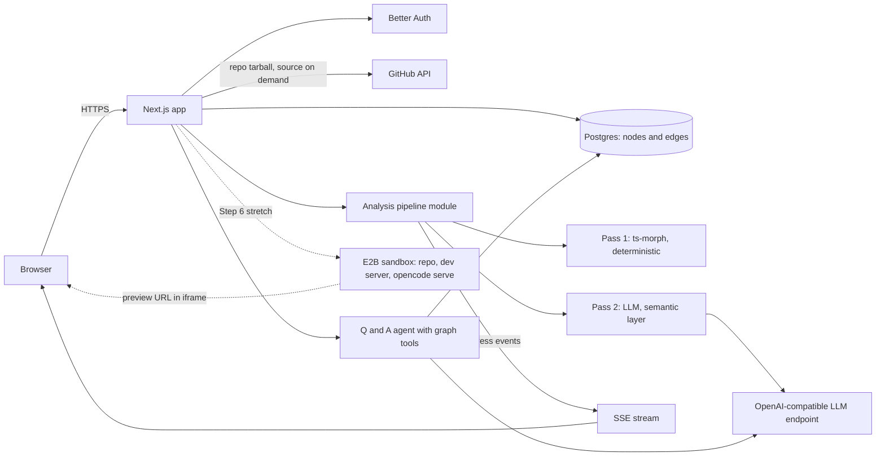
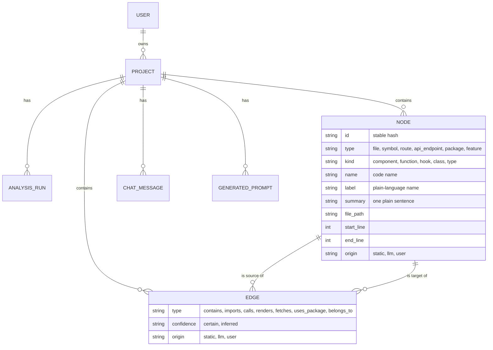
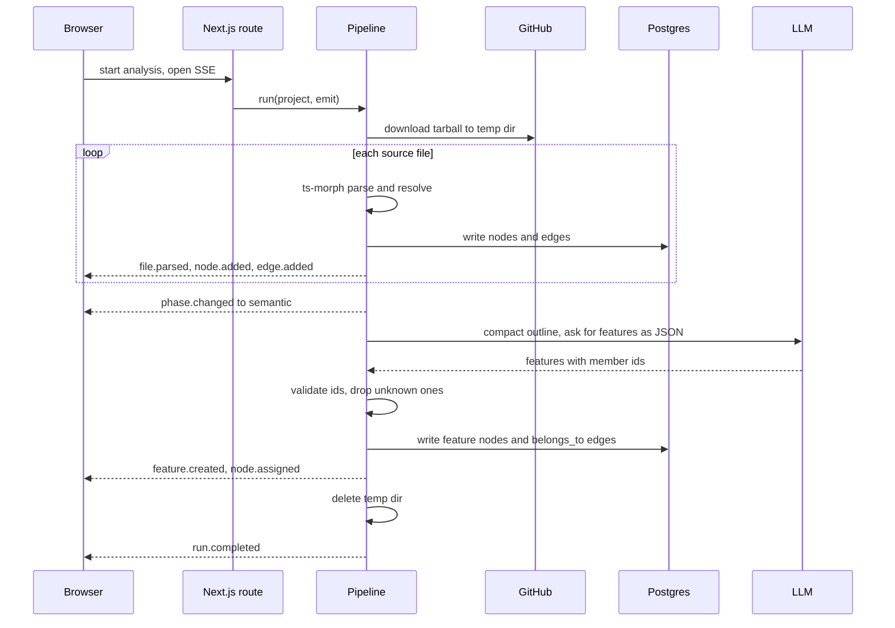
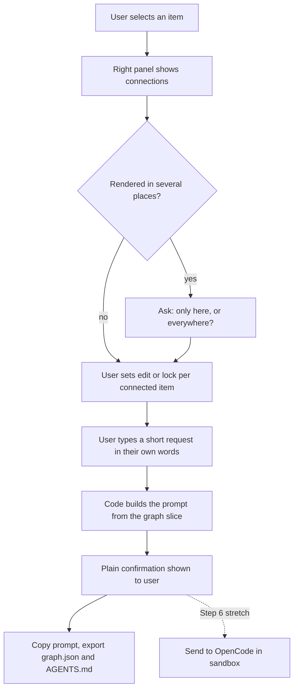
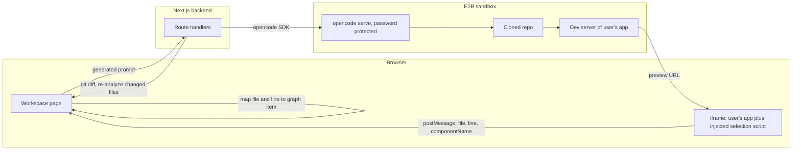

# Vestra Code: MVP build instructions

You are implementing the MVP of a web product together with David, the founder. This document is your brief. Read all of it before writing any code. It tells you what the product is, what has already been decided, how to work with David, and what to build in which order.

The product is called **Vestra Code**. Use "Vestra Code" (two words, both capitalized) in the UI and page titles, and `vestra-code` for the package name, repo, and identifiers. "Vestra" alone is the brand; "Code" marks this as its first product, for codebases.

---

## 1. What we're building and why

**The problem.** People now build real software by "vibe coding" with AI agents. It works at first, then the project gets away from them. As features pile up, the human no longer has a mental model of their own codebase, and the coding agent loses track too: it calls functions that don't exist, re-implements helpers that already exist, and touches parts of the app nobody asked it to touch. The founder's line for this: "내가 만들었지만, 내 손을 떠난 프로젝트."

**The product.** A web service where a user connects a GitHub repo. We analyze the code into a semantic knowledge graph (SKG): code structure extracted deterministically, plus a semantic layer ("these files are the Checkout feature") added by an LLM. That one graph serves two audiences:

- **The human** gets a map of their app in plain language, can ask questions about it, and can point at a part of it and say what they want changed.
- **The coding agent** gets a precise, scoped prompt paired with the relevant slice of the graph, so it works from facts about the codebase instead of guesses.

**Target user.** Someone who builds with AI agents and may not be able to read the code well. They might not know what a UI component is called. Every design decision should pass this test: could someone who has never opened a code file use this?

**The core UX principle: hide the graph.** The SKG is the engine, never the vocabulary. The words "triple", "ontology", "node", "edge", and "entity" never appear in user-facing copy. Users see a map of their app, features with plain names, questions, and connections described as "uses", "is used by", "sends data to", "saves to". A raw graph view exists, but as an opt-in tab, not the default.

---

## 2. How to work with David

David is technical (systems-level CS background, has shipped production software) and short on time. He wants you to move fast and make sensible calls on your own, and to involve him where his input is actually needed.

### When to ask

Ask David only when one of these is true:

1. **You need something only he can provide**: an API key, an OAuth app, an account action.
2. **The decision changes product behavior or scope**, or contradicts something in this document.
3. **The decision is expensive or hard to reverse**: a paid service, a data model change after data exists, swapping a core library.
4. **There are two reasonable options with materially different tradeoffs** and this document doesn't settle it.
5. **You're blocked** after two real attempts at a problem.

### When not to ask

Decide on your own and record it in `docs/DECISIONS.md` (one line each: decision, reason): file and folder structure, naming, minor library choices, styling details, test structure, copy wording that follows the rules in this document. Asking about these slows David down.

### How to ask

- Batch questions. One message, three questions at most.
- For each question, give the options, your recommendation, and the reason in a sentence. David should be able to reply "go with your picks."
- At the start of each step, list everything you need from him for that step in a single message, so he can gather it while you work on the parts that don't depend on it.

### How to handle problems

- Read the actual error. Check the current documentation for the library involved. This stack moves fast (Next.js 16, Better Auth, OpenCode SDK, E2B), so verify APIs and versions against current docs rather than relying on memory.
- Fix root causes. Don't silence errors, loosen types to `any` to get past a compiler complaint, or stub out failing behavior to make something look like it works.
- After two failed attempts at the same problem, stop. Tell David what you tried, what you learned, and the options you see.
- Never present mock data as real. If something is mocked for now, label it visibly in the UI and in `docs/PROGRESS.md`.

### Step rhythm

Every step in section 7 follows the same loop:

1. **Plan.** State your plan in ten lines or fewer, and list what you need from David.
2. **Build.** Work in small commits.
3. **Verify.** Run the app and check every "done when" item yourself. Run the tests.
4. **Checkpoint.** Report: what works, how David can see it (exact URL or command), known issues, what's next. Update `docs/PROGRESS.md`. Commit.
5. **Wait for David's go-ahead** before starting the next step. Each step ends in something demoable, so he may choose to stop or reprioritize at any checkpoint.

---

## 3. Decisions already made

These came out of a long design discussion. Don't reopen them unless you hit a concrete technical blocker, in which case explain the blocker and propose an alternative.

| Area | Decision |
|---|---|
| First domain | Codebases. MVP supports React and Next.js repos in TypeScript or JavaScript only. |
| Delivery | A standalone web service. Users link a GitHub repo. Public repos only for the MVP; a GitHub App for private repos comes later. |
| Extraction | Two passes. Pass 1 is deterministic static analysis, no LLM. Pass 2 is an LLM adding the semantic layer on top. |
| Human corrections | Anything the user confirms or corrects must survive re-analysis. |
| Honesty in the graph | Every connection is marked `certain` (resolved by the compiler) or `inferred` (heuristic or LLM). The UI shows solid versus dotted lines. The UI never says something is "safe" to change, only "no known connections". |
| Built-in agent | The product has its own agent that answers questions about the project and writes prompts. In the stretch step it also executes them through OpenCode. |
| Model | Configurable, never hard-wired. Default target is Xiaomi MiMo-V2.5 through an OpenAI-compatible endpoint. |
| Trust | We don't persist users' source code. We store the graph, file paths, line ranges, and file hashes. Source is fetched on demand and discarded. |
| Layout | Left: feature list (with a Files tab). Center: main view. Right: context-sensitive panel with List and Graph tabs. Bottom: a collapsed timeline strip (placeholder in the MVP). See the wireframe below. |

### Workspace wireframe

This is the target layout for the `/app/[project]` workspace. Proportions are approximate: left about 15%, right about 25%, center takes the rest. The center panel must stay wide, because in Step 6 it hosts a live website preview that breaks if squeezed.

```
+------------------------------------------------------------------------+
| Vestra Code     project-name                         [Export]  [Menu]  |
+---------------+------------------------------------+-------------------+
| [Features]    |                                    | [List]  [Graph]   |
|  Files        |  MAIN VIEW                         |                   |
|               |                                    | Connected to      |
|  Login        |  Steps 3-5: the map of the app     |  Pay button  edit |
|  Checkout  <  |  Step 6:    live preview of app    |  Checkout    edit |
|  Cart         |                                    |  Payment API lock |
|  Dashboard    |                                    |  Orders      lock |
|               |                                    |  ---- certain     |
|               |                                    |  .... inferred    |
|               |                     [Select] [<>]  |  Used on 3 pages  |
|               |                                    +-------------------+
|               |                                    | [ ask or request ]|
|               |                                    | [Ask] [Make prompt]|
+---------------+------------------------------------+-------------------+
| Timeline (placeholder)    o-----o-----o-----O                     [^]  |
+------------------------------------------------------------------------+
```

The flow in the right panel reads top to bottom, and that order is deliberate: see what's connected, set what may change (edit or lock), type the request, get the prompt.

### Right panel states

The right panel changes with context. It is never a static graph viewer.

| State | What the panel shows |
|---|---|
| Analysis running | Live activity log, counts so far |
| Nothing selected | Project overview, feature count, a few suggested questions |
| Item selected | Connections in List or Graph tab, lock toggles, the request box |
| Question asked | The answer with clickable citation chips |
| Prompt generated | Plain-language confirmation, "Show prompt" toggle, copy and export buttons |

---

## 4. MVP scope

**In scope**

1. Landing page
2. Sign up and login with GitHub and Google
3. Link a public GitHub repository
4. Analysis with the graph building live on screen
5. Graph exploration: feature list, connections panel, graph view with hop control
6. Project Q&A grounded in the graph, with clickable citations
7. Selection of a part of the app, then prompt generation paired with the relevant graph slice
8. Graph export (`graph.json`) and a generated `AGENTS.md` for coding agents

**Stretch (Step 6, only if David says go)**

- Live preview of the user's app in a cloud sandbox, with click-to-select on the rendered page
- Executing the generated prompt through OpenCode in that sandbox, then showing what changed

**Out of scope for the MVP.** Don't build these, and don't add abstractions for them: step-by-step change timeline and undo, feature-level undo, variant branching, guardrail checks on agent diffs, "what to build next" gap detection, private repos, languages other than TS/JS, billing, teams. The bottom timeline strip exists as a visual placeholder only.

---

## 5. Stack

| Layer | Choice | Notes |
|---|---|---|
| App | Next.js 16 (App Router), TypeScript strict, Tailwind, shadcn/ui | One codebase for landing, app, and API |
| Auth | Better Auth with GitHub and Google providers | Check the session on each protected page and route handler. Don't rely on middleware/proxy alone for protection. |
| Database | Postgres (Neon) with Drizzle ORM | Plain `nodes` and `edges` tables. No graph database. |
| Static analysis | ts-morph | Real cross-file symbol resolution through the TypeScript compiler |
| Graph rendering | react-force-graph (2D in the app, 3D on the landing page) | Must be dynamically imported with SSR disabled |
| LLM access | Vercel AI SDK with an OpenAI-compatible provider | Configured only by env: `LLM_BASE_URL`, `LLM_API_KEY`, `LLM_MODEL` |
| Live updates | Server-Sent Events | For analysis progress and agent output |
| Tests | Vitest | Focus on the parser, graph store, and prompt builder |
| Sandbox (stretch) | E2B | Hosts the user's repo, its dev server, and `opencode serve` |
| Coding agent (stretch) | OpenCode via `opencode serve` and `@opencode-ai/sdk` | Proxied through our backend, never exposed directly |

Before installing anything, check the current stable version and its setup docs. If a choice in this table turns out to be broken or unmaintained, tell David and propose a replacement.

Keep secrets in `.env.local`, keep `.env.example` current with every variable the app reads, and never commit a secret.

---

## 6. Architecture

Diagrams in this document are written in Mermaid. They render as images on GitHub and in most IDEs, and they're meant to be read as text too.

### 6.0 System overview



Solid arrows are the MVP. Dotted arrows exist only in the Step 6 stretch.

### 6.1 Data model



Design the schema around these requirements. Exact column names are yours to choose.

**Tables:** `projects`, `analysis_runs`, `nodes`, `edges`, `chat_messages`, `generated_prompts`, plus whatever Better Auth generates.

**Node types**

| Type | Meaning | Source |
|---|---|---|
| `file` | A source file | static |
| `symbol` | A component, function, hook, class, or type (`kind` field) | static |
| `route` | A page the user can visit | static |
| `api_endpoint` | A server route | static |
| `package` | An external dependency actually imported | static |
| `feature` | A plain-language grouping, like "Checkout" | llm or user |

Each node carries: a stable id, type, kind, code name, plain-language label, one-sentence plain-language summary, file path, start and end line, `origin` (`static`, `llm`, or `user`), and a JSON metadata field.

**Edge types:** `contains` (file → symbol), `imports` (file → file), `calls` (symbol → symbol), `renders` (component → component), `fetches` (symbol → api_endpoint), `uses_package`, `belongs_to` (anything → feature).

Each edge carries: `confidence` (`certain` or `inferred`) and `origin` (`static`, `llm`, or `user`).

**Two rules that matter:**

1. **Stable ids.** Derive node ids from a hash of project id, type, file path, and symbol name. Re-analysis must produce the same id for the same thing, so user corrections and chat citations keep pointing at the right place.
2. **User rows win.** Re-analysis replaces `static` and `llm` rows. It never deletes or overwrites a row with `origin = user`. If a user moved a file into a different feature, that stays.

### 6.2 Analysis pipeline

Write the pipeline as a plain module that takes a project and an event emitter and knows nothing about HTTP. The route handler is a thin wrapper. This keeps it testable and lets it move to a background worker later without a rewrite.

**Ingest.** Download the repo tarball from the GitHub API into a temp directory. Skip `node_modules`, build output, lockfiles, binaries, and anything over a size threshold. Enforce a cap on file count and tell the user clearly if a repo is too large for the MVP. Delete the temp directory when the run ends, including on failure.

**Pass 1, static (ts-morph).** Guidance:

- Create the ts-morph project without depending on the repo's `tsconfig.json`, since it may be missing or broken. Enable `allowJs` and JSX. Dependencies won't be installed, so external types won't resolve. That's fine: intra-project resolution still works, and that's what we need.
- Extract exported and top-level functions, components, hooks, and classes as `symbol` nodes.
- For call expressions, resolve the definition through the type checker. Resolved means a `certain` edge. If resolution fails but there's a unique name match in the project, record an `inferred` edge. If ambiguous, record nothing.
- JSX elements that resolve to project components become `renders` edges.
- Next.js `app/` and `pages/` conventions give you `route` and `api_endpoint` nodes.
- `fetch` or client calls with a string literal path matching a known endpoint become `inferred` `fetches` edges.
- One unparseable file must not fail the run. Record it and continue.

**Pass 2, semantic (LLM).** Guidance:

- Send a compact outline: paths, symbol names and kinds, routes, and the import graph. Don't send full source. This keeps cost and latency low.
- Ask for structured JSON: features with a plain name, a one-sentence description a non-developer would understand, and member node ids.
- Validate the response. Drop any id that doesn't exist in the graph rather than trusting it. Log how many were dropped.
- Aim for roughly 5 to 12 features for a typical app. Feature names read like product areas ("Login", "Payments"), not code ("AuthProvider").
- Then generate plain-language labels and summaries for the most connected symbols, in batches.
- Generate user-facing text in the UI language chosen in Step 0.

**What one analysis run looks like end to end:**



**Events.** Stream progress to the client over SSE. A workable event set: `run.started`, `phase.changed`, `file.parsed`, `node.added`, `edge.added`, `feature.created`, `node.assigned`, `run.completed`, `run.failed`. Persist as you go so a page refresh mid-run recovers from the database.

### 6.3 Q&A agent

A small tool-calling loop using the AI SDK. Give the model these tools: `search_nodes(query)`, `get_neighbors(node_id, hops)`, `get_feature(name)`, and `read_source(node_id)`, which fetches that node's line range from GitHub on demand.

Rules for the system prompt you write:

- Answer only from what the tools return. If the graph doesn't contain the answer, say that plainly.
- Cite every claim about the codebase with a node reference in a fixed marker format that the UI turns into clickable chips.
- Answer in plain language first. Code details come second and only when useful.
- State uncertainty when the supporting connections are `inferred`.

Clicking a citation chip highlights that item in the graph and the feature list.

### 6.4 Prompt generation

This feature is the point of the product. The user selects something, types a short request in their own words, and we produce a prompt a coding agent can act on precisely.



Build the prompt from the graph with code, using a template. The LLM's only job is to restate the user's goal clearly. The generated prompt has these sections:

1. **Goal**: the user's request, restated clearly.
2. **Where**: the selected items with file paths and line ranges.
3. **Connected context**: what the selection uses and what uses it, to the chosen depth, each marked certain or inferred.
4. **Allowed to change** and **Do not touch**: from the user's lock toggles.
5. **Reuse these**: existing helpers and components relevant to the request, so the agent doesn't duplicate them.
6. **Shared component warning**: if the selected component is rendered in several places, list them and ask the user to choose "only here" or "everywhere" before generating.
7. **Rule**: "If you need to change something outside the allowed list, stop and explain why before doing it."

The user sees a plain confirmation ("I'll change the Pay button on Checkout only"). The raw prompt sits behind a "Show prompt" toggle, with a copy button.

**Export.** `graph.json` (nodes and edges with a documented schema) and a generated `AGENTS.md` summarizing the project: features, where each lives, key conventions observed, shared components. Both downloadable.

---

## 7. Build steps

### Step 0: Alignment (no code)

Ask David, in one message:

1. UI language: Korean, English, or both (if both, which is the default)
2. The deadline, and whether the demo is live or recorded
3. Where it will be deployed (this affects how long analysis requests can run; mention that tradeoff)
4. Which public repo to use as the primary demo and test target (suggest he pick a small Next.js app he knows well)

While waiting, read the current docs for Next.js 16, Better Auth, Drizzle, ts-morph, and react-force-graph, and note anything that conflicts with this brief.

**Done when:** answers are recorded in `docs/DECISIONS.md`.

### Step 1: Scaffold, landing page, auth

**Need from David:** a GitHub OAuth app (client id and secret) and a Google OAuth client, both with the callback URLs you specify exactly, and a Neon `DATABASE_URL`. Generate the auth secret yourself. Tell him the exact values to enter in each provider's console.

**Build**

- Project scaffold, Drizzle schema and migrations, Better Auth with both providers, a protected `/app` area, sign in and sign out.
- The landing page. Visual reference: framer.com. What to take from it: dark background, one very large headline, the product's own UI as the hero instead of stock imagery, a bento grid of feature cards below, a closing call to action. Take the structure and confidence, not the assets or copy.
- **Hero concept:** a 3D force graph that begins as a tangled mess and untangles into labeled, colored clusters as the user scrolls. The visual is the pitch: chaos becoming a map. It reacts subtly to the pointer.
- **Headline:** "내가 만들었지만, 내 손을 떠난 프로젝트." Supporting copy should name the specific pains in a way a vibe coder recognizes: the agent rewrote something that already existed, a small change broke another page, you're afraid to touch your own app.
- Feature cards: see your app as a map, ask anything about your project, point at what you want changed, hand your agent a prompt it can't misread.
- Performance: lazy-load the 3D scene, provide a static fallback for mobile and for `prefers-reduced-motion`, and keep the headline as real text that renders before the canvas.

Use your frontend design judgment here. This page should look designed, not templated.

**Done when:** a new user can land, sign in with either provider, reach an empty `/app` dashboard, and sign out. The landing page stays smooth on a mid-range laptop.

### Step 2: Link a repo and run static analysis

**Need from David:** nothing required. Unauthenticated GitHub API calls are rate limited, so use the signed-in user's GitHub token when they have one and mention the option of a server token as fallback.

**Build**

- "Add project" flow: paste a public GitHub URL, validate it, confirm it looks like a supported React or Next.js project, create the project. If it's unsupported, say so kindly and specifically.
- Ingest and Pass 1 from section 6.2, writing to the database and emitting events.
- A small fixture project in the repo (a few pages, shared components, an API route, a helper used in several places) with Vitest tests asserting the expected nodes and edges. **The parser is the foundation of the product. If the graph is wrong, everything built on it misleads the user.** Put real effort into these tests, including the certain versus inferred distinction and stable ids across two runs.

**Done when:** analyzing the fixture and David's demo repo produces a correct graph in the database, tests pass, and a second run yields identical ids. Show David a few concrete numbers and spot-checks (for example: "`formatPrice` is called from these 4 places") so he can verify against a codebase he knows.

### Step 3: The live graph view

**Build**

- The workspace layout from section 3.
- The analysis screen: as events stream in, items appear in the graph with a live activity log beside it ("Reading checkout/page.tsx", "Found 3 components"). The reference feel is Obsidian's graph view: organic, force-directed, satisfying to watch. This must show real work. Don't fake delays or replay canned animations.
- Performance: buffer incoming events and apply them in batches (roughly every 100 ms) so the simulation doesn't thrash. Cap what's rendered at once. Default to a collapsed, feature-level view and expand on demand.
- Selecting an item fills the right panel. **List tab** (default): a plain-language chain of what it uses and what uses it, solid or dotted markers, a lock toggle per item. **Graph tab:** the same neighborhood as a graph centered on the selection, with a hop slider from 1 to 3.
- The left panel lists features after Step 4 exists. Until then it shows files, and the panel is built so that swap is trivial.

**Done when:** David can watch his demo repo build live, refresh mid-run without losing state, click any item, and see its connections in both tabs.

### Step 4: Semantic layer, Q&A, prompt generation, export

**Need from David:** `LLM_BASE_URL`, `LLM_API_KEY`, `LLM_MODEL`. Remind him that because the provider is OpenAI-compatible and env-configured, he can start with any model he already has a key for and switch later.

**Build**

- Pass 2 from section 6.2. During analysis, clusters visibly gain color and names as features are created. The left panel switches to features-first.
- Let the user fix the map: rename a feature, and drag a file or item from one feature to another. These write `origin = user` rows.
- The Q&A agent from section 6.3, in a chat panel, with citation chips that highlight items.
- Prompt generation and export from section 6.4.
- Vitest coverage for the prompt builder: given a fixture selection and lock state, the output contains the right paths, the right locked items, and the shared-component warning when applicable.

**Done when:** on the demo repo, feature names make sense to David, a correction survives a re-analysis, Q&A answers a "where does X happen" question correctly with working citations and admits when it doesn't know, and a generated prompt pasted into a coding agent is specific enough to act on without follow-up questions.

### Step 5: Polish and demo readiness

Do this before any stretch work. A smaller product that works end to end beats a bigger one that breaks on stage.

- Empty, loading, and error states everywhere, written in plain language that says what happened and what to do next.
- A guided first run: after the first analysis, walk the user through one question and one prompt.
- Walk through the whole flow as a non-developer would and fix every place that assumes code knowledge. Search the UI copy for the forbidden vocabulary from section 1.
- Deployment to the target from Step 0, with a production env checklist for David.
- Write `docs/DEMO.md`: a three-minute demo script using the demo repo, with a fallback path if analysis is slow (a pre-analyzed project ready to open).

**Done when:** someone who hasn't seen the product completes the demo script without help.

### Step 6 (stretch): Live preview, click-to-select, OpenCode execution

Start only with David's explicit go-ahead. Begin with a short written proposal and get his agreement, because this step has the most unknowns.

**Need from David:** an E2B API key.

**Approach**



The browser never talks to OpenCode directly. Everything goes through the backend.

- One sandbox per session: clone the repo, install, start the dev server, expose its port, and show it in an iframe in the center panel. Many real repos won't boot without env vars or a database. Detect that, explain it, and fall back to the graph-based selection from Step 4. The demo repo must be one that boots cleanly.
- **Click-to-select.** The iframe is cross-origin, so the parent page can't read its DOM. The selection overlay must run inside the user's app: inject a small script that draws the hover outline, handles click and drag-lasso, and sends `{file, line, componentName}` to the parent with `postMessage`. The parent maps file and line to a graph item using stored line ranges. Mapping DOM elements back to source needs a build-time transform that stamps elements with source locations, because recent React versions no longer expose this at runtime. Research the currently maintained options for this, then propose one to David before building. Lasso selection resolves to the nearest common parent component.
- **OpenCode.** Run `opencode serve` inside the sandbox with a password. Our backend talks to it through `@opencode-ai/sdk`: create a session, send the generated prompt, stream events to the UI. The browser never talks to OpenCode directly. When the run ends, diff the working tree, re-analyze only changed files, and highlight added, changed, and removed items on the map with a plain-language summary. If the diff touched anything the user locked, say so prominently.
- Always tear sandboxes down, and cap session length, to control cost.

**Done when:** on the demo repo, David clicks a button in the live preview, types a request, watches the agent make the change, sees the preview update, and sees what changed on the map.

---

## 8. Quality bar

- TypeScript strict, no `any` without a comment explaining why.
- Validate every external input (URLs, LLM output, GitHub responses) with a schema. Treat LLM output as untrusted data.
- Every server route checks the session and that the project belongs to the user.
- User-facing errors are plain language. Technical detail goes to logs.
- Keep two living docs: `docs/DECISIONS.md` and `docs/PROGRESS.md`. A new contributor, or a fresh session of you with no memory of this one, should be able to pick up from those two files and this brief.
- Prefer the simple thing that works. This is an MVP under time pressure. If you find yourself building a general framework, stop and build the specific thing.

## 9. Start here

Confirm you've read this brief by summarizing it back to David in five sentences or fewer, then send the Step 0 questions.
